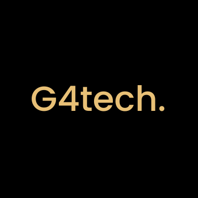
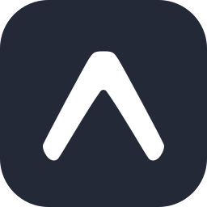
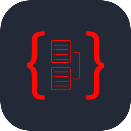
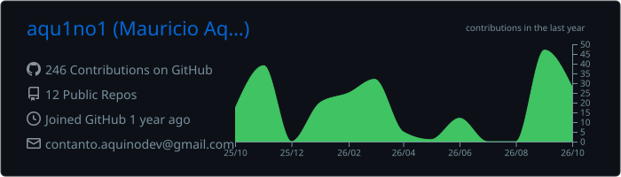

 

---

<table>
<tr>
<td width="60%" valign="top">

###  About me

Hi, I'm Mauricio. 👋

-  6th-semester **Software Engineering** student at **UTFPR** (Cornélio Procópio campus).
- **Full stack** developer, mostly working with **TypeScript**.
- I enjoy following a project all the way from the database to the screen.
- Currently at **Unect Jr.** and **G4tech**, and contributing to the **TEDI** project (web app, API and documentation).

</td>
<td width="40%" align="center" valign="middle">

</td>
</tr>
</table>

---

###  Education

<table>
<tr>
<td width="50%" align="center" valign="top">

<h4>UTFPR · Federal University of Technology – Paraná</h4>

<b>B.S. in Software Engineering</b>

Cornélio Procópio campus · currently in the 6th semester

</td>
<td width="50%" align="center" valign="top">

<h4>Etec Lauro Gomes</h4>

<b>Technical Degree in Mechatronics</b>

São Bernardo do Campo, SP

</td>
</tr>
</table>

---

###  Experience

<table>
<tr>
<td width="50%" align="center" valign="top">

<h4>Unect Jr.</h4>

<b>Backend Advisor</b>

Helped build systems for medical clinics, working on the API, business rules and database. I like to get ahead of problems and I'm always ready to help the team.

</td>
<td width="50%" align="center" valign="top">

<h4>G4tech</h4>

<b>Junior Full Stack Developer</b>

Started as an intern and was promoted to junior developer. Worked on web and mobile projects and on the backend, from building interfaces to integrating APIs.

</td>
</tr>
</table>

---

###  Tech Stack

<b>See full stack</b>

 

<h4>Languages</h4>

<h4>Frameworks</h4>

React, React Native, Expo, Node.js, Express and NestJS

<h4>Databases</h4>

<h4>ORMs</h4>

Prisma and TypeORM

<h4>API Testing</h4>

Postman and Bruno

<h4>DevOps & Version Control</h4>

<h4>Operating Systems</h4>

---

###  GitHub Stats

  

